# Notes-App
In this project, I decided to learn more about Core data so I created this iOS app to help users create short notes as reminders and categorize them into folders.
This project uses some dependencies ( just a few eg BottomSheet).

### Note ⚙️
The application was built using: 
* Xcode 12.5.1
* Swift 5.6
* macOS Big Sur 11.5.2

### Core Technologies 📲
* Swift
* Programmatic UI
* Protocol Delegation
* Core Data
* MVVM with Combine
* Custom Collection view layout (Compositional Layout)

### Features
This project covers the following concepts
* Users can create an account with  full name
* User can set a pin to protect all notes and folders
* User can create a folder, update a folder and delete a folder with all its related notes
* User can see all folders created
* User can search for a folder

* User can create,edit and delete a short note
* User can also search for a short note

# Snapshots
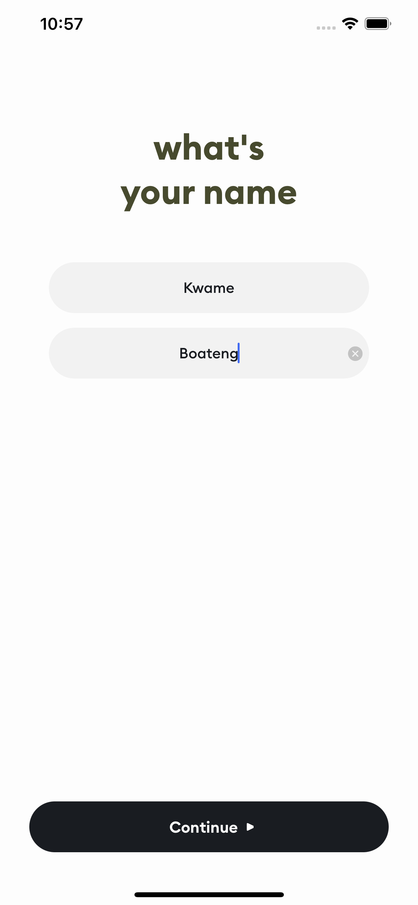
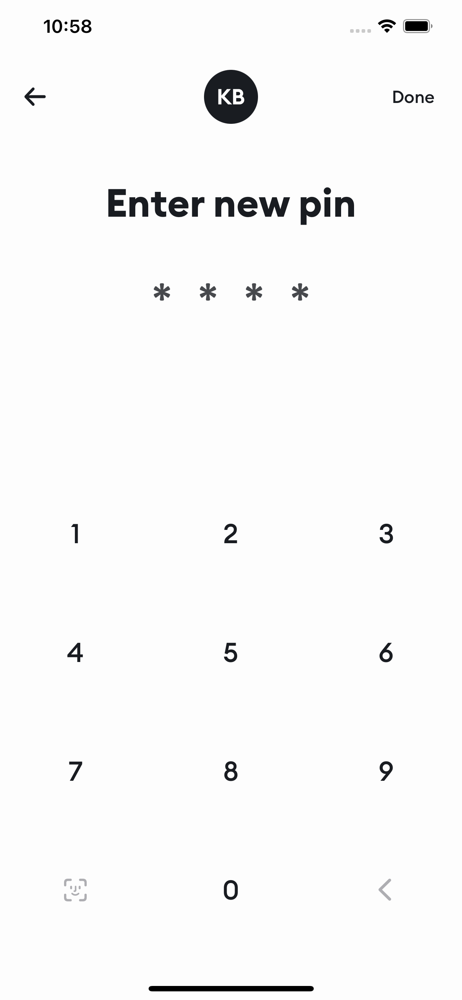
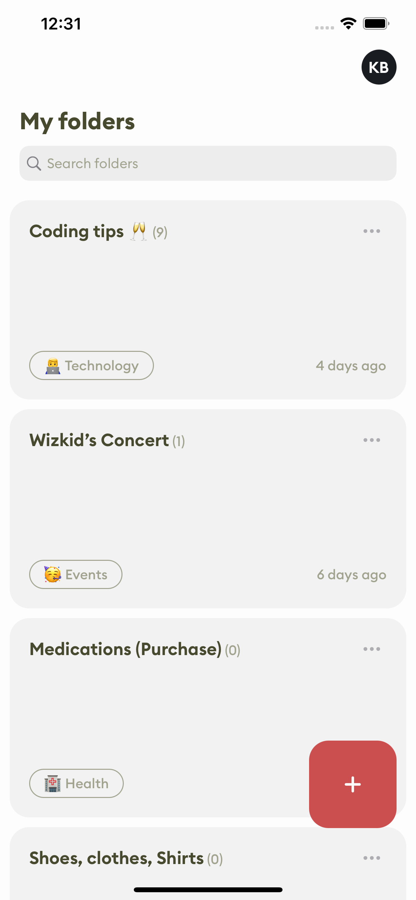

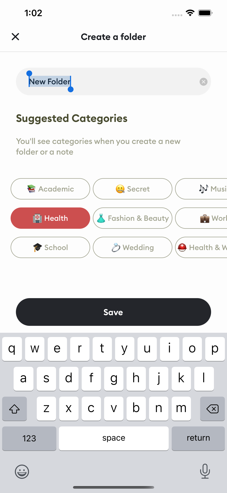
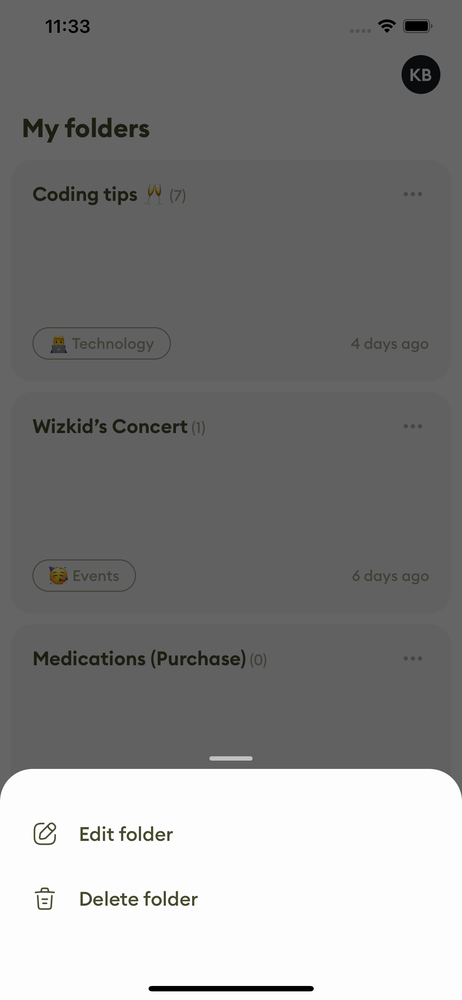
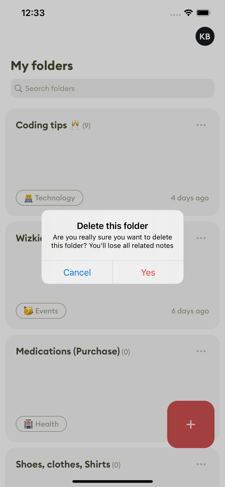

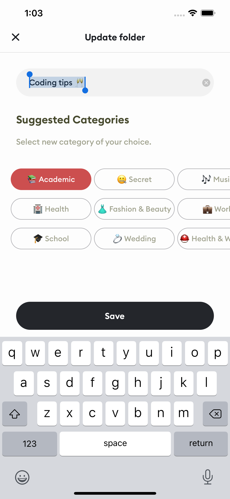
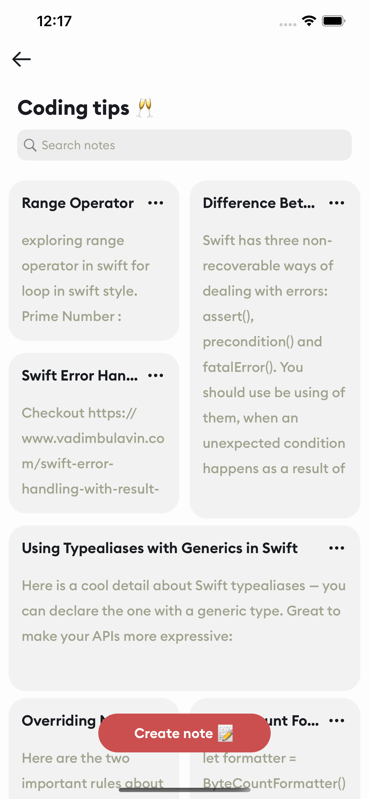
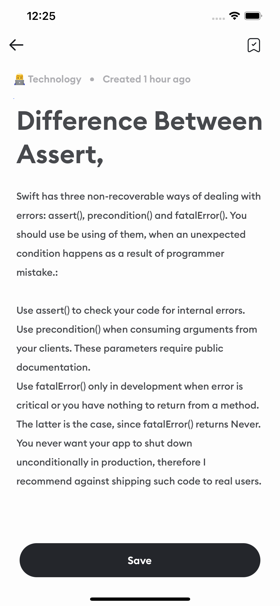

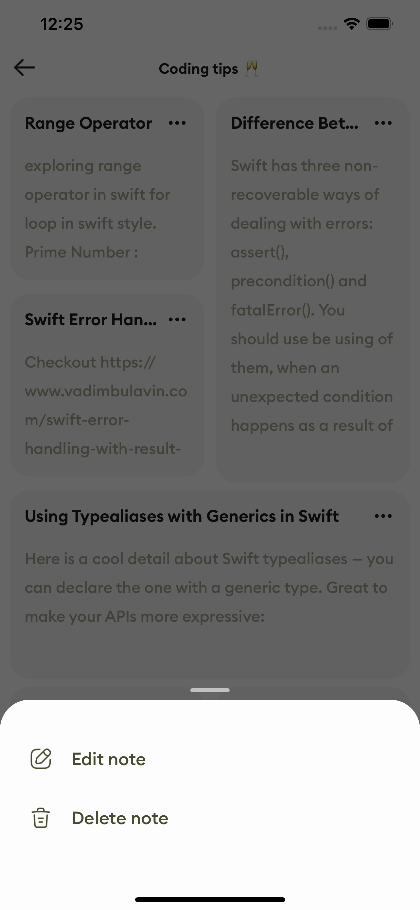
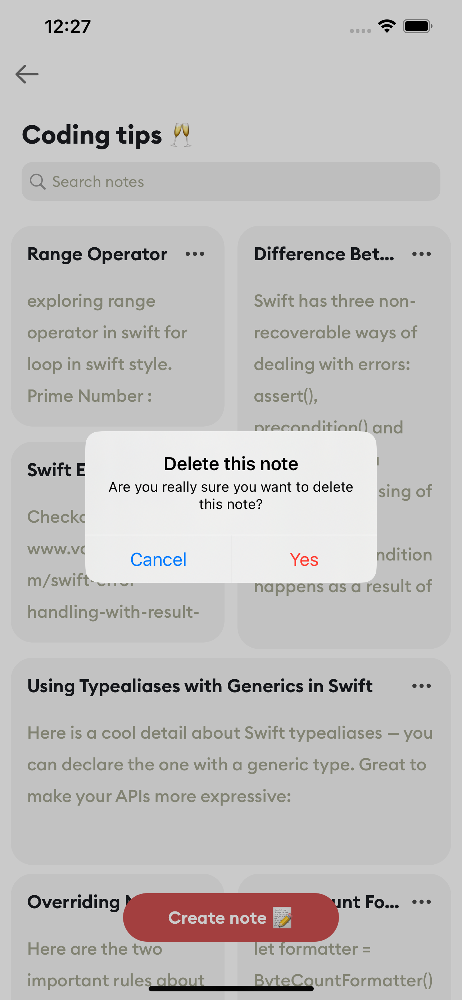

