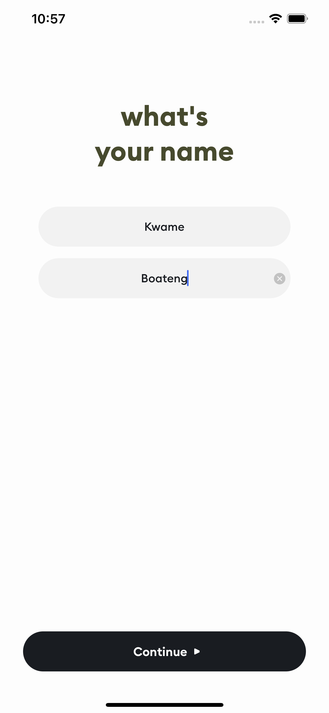
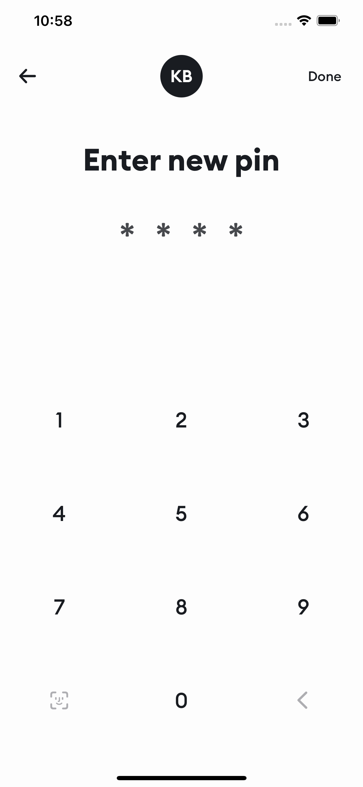
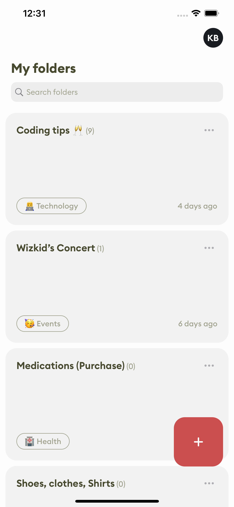
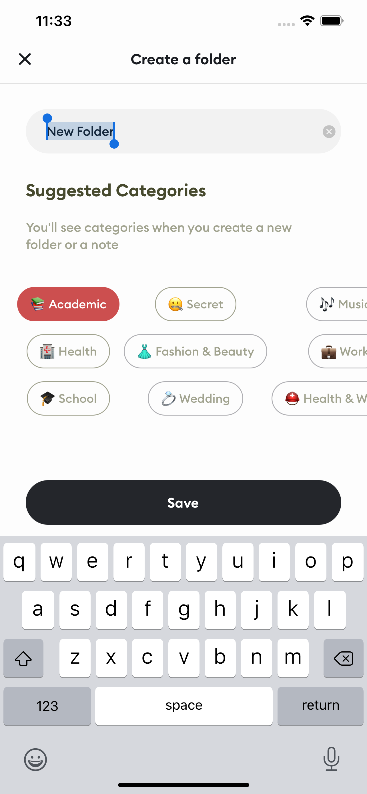
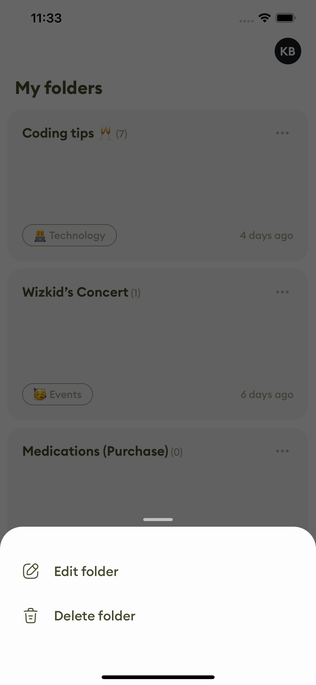
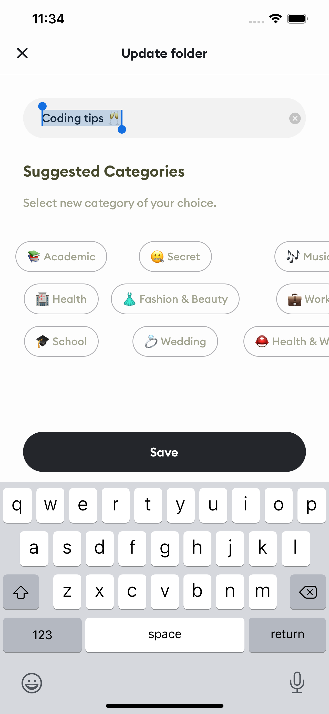
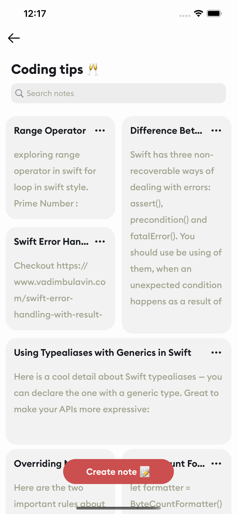
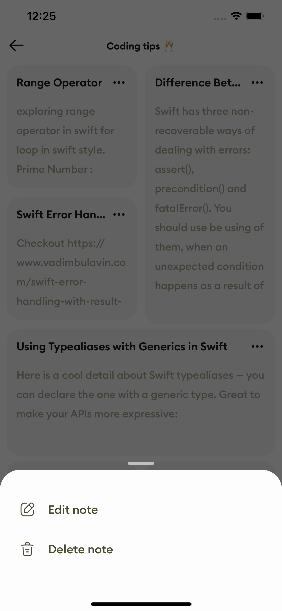
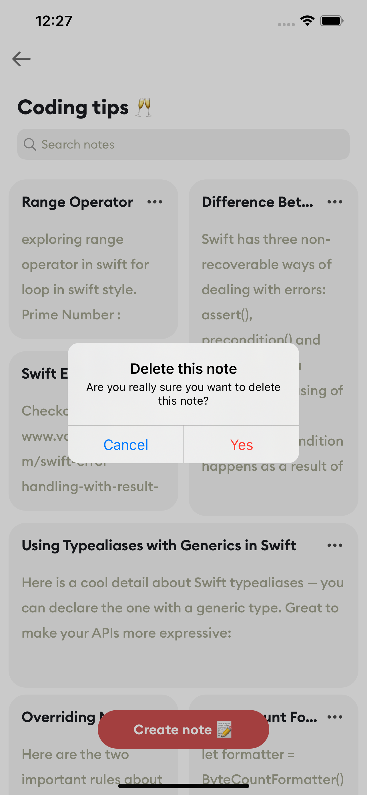

# Notes-App
Decided to learn more about Core data so this iOS application helps users create short notes as reminders and categorize them into folders.

### Note ⚙️
The application was built using: 
* Xcode 12.5.1
* Swift 5.7
* macOS Big Sur 11.5.2

### Core Technologies 📲
* Swift
* Programmatic UI
* Protocol Delegation
* Core Data

### Features
* Users can create an account with his full name
* User can set a pin to protect all notes and folders
* User can create a folder
* User can update a folder
* User can delete a folder with all its related notes
* User can see all folders created

* User can create short note
* User can edit short note
* User can delete short note

# Screenshots

